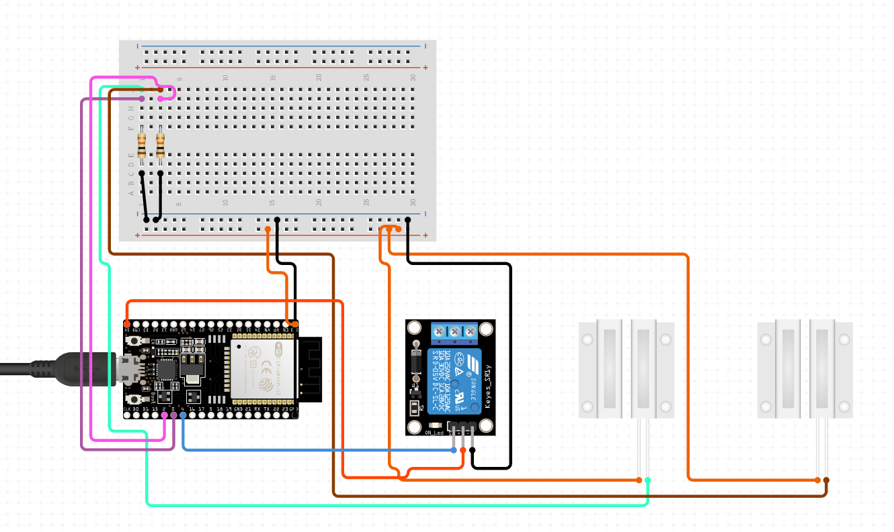

# WORK IN PROGRESS!!

# Roll off Roof Controller

ESP32 based standalone controller for a roll off roof observatory.

*Features*
- :llama: ASCOM Alpaca compatible Dome API
- :crystal_ball: ASCOM Alpaca autodiscovery
- *TODO* :iphone: Web interface for setup and control

## Hardware

https://www.circuito.io/app?components=513,360217,653574,653574,3061987

## Links

[ASCOM Alpaca API](https://ascom-standards.org/api/#/)
[ASCOM Alpaca Management API](https://ascom-standards.org/api/?urls.primaryName=ASCOM%20Alpaca%20Management%20API#/Management%20Interface%20(JSON)/get_management_v1_configureddevices)
[How to use ASCOM Alpaca for ESP32](https://github.com/DanielVanNoord/AlpacaDiscoveryTests/tree/master)

